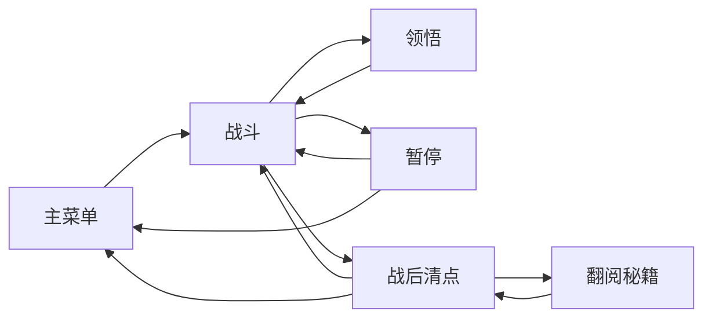

# 11 Audio HUD Pause

## 目的

声音、HUD、暂停和页面不是附属项。它们决定用户是否能持续游玩：

- 声音负责即时反馈、危险预警和节奏。
- HUD 负责读局，不应该抢走战斗视野。
- 暂停页负责安全中断、重开、设置和退出。
- 页面流负责从开始、战斗、领悟、战后清点、抽秘籍到再开一局的完整闭环。

## 第一性原则

- 战斗中用户没有时间读长文字，HUD 必须短、清楚、稳定。
- 声音必须增强反馈，不能靠刺耳和堆叠制造刺激。
- 暂停必须真的暂停规则层，不能只是显示 UI。
- 移动端优先保证触控尺寸和不遮挡。

## P0 声音清单

完整音频事件、优先级、节流和音量预算见 [23 Audio Event Table](23-audio-event-table.md)。

## 音频制作方案

MVP 不先追求商用品质音频，先追求“事件可读 + 不刺耳 + 可控体积”。

制作优先级：

1. 先用程序合成或占位音效验证事件触发、音量、节流和静音逻辑。
2. 再用可用的生成式音频 API 制作武侠风短音效和 1 条青石山道 BGM 草案。
3. 最后用 Audacity、ffmpeg 或等效工具统一响度、裁切静音、转码为 `.ogg`。

API 使用边界：

- 可以使用本机私有 API key 生成音效或 BGM 草案，但 key 不写入仓库、不写入日志、不写入提交。
- API 只用于生成素材，不参与游戏运行时逻辑。
- 每个生成素材必须落到资产 manifest，并保留提示词、用途、版本和人工筛选结果。
- 如果 API 生成结果不稳定，优先保留程序合成占位，不阻塞玩法实现。

音频产物要求：

- 短音效 <=100KB，优先 `.ogg`。
- BGM MVP <=3MB，循环点必须自然，不强制做复杂编曲。
- 同一事件至少保留 1 个可用版本；高频事件可准备 2 到 3 个轻微变化，避免疲劳。

| 事件 | 音效 | 要求 |
| --- | --- | --- |
| 普通命中 | `hit_light` | 短、轻，不刺耳，高频时节流 |
| 敌人死亡 | `enemy_die` | 有爽感，但不能盖过领悟/头目 |
| 内力拾取 | `inner_power_pickup` | 清脆，连续拾取可合并播放 |
| 铜钱获得 | `copper_gain` | 与内力音区分 |
| 领悟 | `insight` | 明显强反馈 |
| 招式进阶 | `skill_advance` | 比普通领悟更强 |
| 少侠受伤 | `hero_hurt` | 明确警示，但不惊吓 |
| 生命过低 | `low_hp_loop` | 可选，必须可关闭 |
| 头目入场 | `boss_intro` | 0.5 到 1.5 秒 |
| 头目预警 | `boss_warning` | 比技能发生早至少 0.5 秒 |
| 按钮点击 | `ui_click` | 轻量 |
| 暂停/继续 | `pause_toggle` | 轻量 |
| 翻阅秘籍揭示 | `scripture_reveal` | 稀有度可分层 |

## 音频控制

MVP 必须提供：

- 全局静音。
- 主音量。
- 音乐音量。
- 音效音量。
- 设置写入 `localStorage`。

建议默认值：

| 设置 | 默认 |
| --- | ---: |
| `masterVolume` | 1.0 |
| `musicVolume` | 0.6 |
| `sfxVolume` | 0.8 |
| `muted` | false |

音频预算：

- 同类命中音效 0.08 秒内最多播放 1 次。
- 内力拾取音效 0.05 秒内合并。
- 同时播放音效建议 <=24。
- 头目预警、领悟、受伤音效优先级高于普通命中。

## HUD 信息层级

详细 HUD 布局、页面状态机、暂停行为和移动端尺寸见 [21 HUD Pause Screen Flow Detail](21-hud-pause-screen-flow-detail.md)。

战斗 HUD 只显示当前决策需要的信息。

玩家可见文案以 [12 Wuxia Style And Level](12-wuxia-style-and-level.md) 的 HUD 文案表为准：战斗 HUD 使用 `等级`、`内力`、`铜钱`、`招式`、`领悟`、`进阶`、`战后清点`、`翻阅秘籍`，不混用 `境界`、`经验`、`金币`、`武器`、`升级`、`抽卡`。

P0 HUD：

| 位置 | 内容 | 要求 |
| --- | --- | --- |
| 左上 | 主血量、等级 | 不超过 2 行文字，始终可读 |
| 顶部中间 | 内力条 | 横向清楚，不挡少侠 |
| 右上 | 时间、击杀、暂停按钮 | 暂停按钮触控区 >=48x48 桌面，>=72x72 移动端 |
| 底部或侧边 | 当前招式槽 | 最多显示 4 到 6 个图标 |
| 头目出现时 | 头目血条 | 顶部或底部独立显示 |
| 领悟时 | 三选一卡片 | 战斗暂停或慢动作 |

血量显示规则：

- 主血量放在左上 HUD，必须常驻显示。
- 少侠脚下可以显示辅助血条，但只作为近场反馈，不作为唯一血量来源。
- 脚下辅助血条默认隐藏；受伤后显示 2 秒，生命低于 30% 时常驻显示。
- 脚下辅助血条宽度建议为少侠碰撞直径的 1.2 到 1.6 倍，高度 4 到 6px，距离脚底 8 到 14px。
- 脚下辅助血条不能挡住少侠轮廓、内力光点、危险刀痕或近身招式。
- 不在少侠脚下显示血量数字，避免满屏战斗时读数困难。

不在战斗 HUD 常驻：

- 长说明文字。
- 翻阅秘籍入口。
- 商店入口。
- 复杂属性列表。
- 朋友试玩统计。

## HUD 可读性门槛

| 项 | 通过线 |
| --- | --- |
| 少侠附近无遮挡 | 少侠半径 180px 内不放常驻 HUD |
| 移动端正文 | 不小于 22px |
| 关键数字 | 不小于 24px |
| 图标 | 不小于 48x48，移动端建议 56x56 |
| 暂停按钮 | 移动端触控区不小于 72x72 |
| 头目血条 | 头目出现 1 秒内显示 |
| 低血量 | 生命低于 25% 有视觉或声音提示 |
| 脚下辅助血条 | 受伤后 2 秒显示，低于 30% 常驻，不能遮挡少侠轮廓 |

HUD 更新规则：

- 主血量、脚下辅助血条、内力、等级、时间、击杀必须实时更新。
- 招式图标在获得或领悟后 0.3 秒内刷新。
- HUD 不能因为数字变长导致布局跳动。

## 暂停页

暂停页 P0 必须包含：

- 继续。
- 重新开始本局。
- 回主菜单。
- 设置。
- 当前局摘要：时间、等级、击杀、当前招式。

设置 P0：

- 主音量。
- 音乐音量。
- 音效音量。
- 静音。
- 低 VFX 模式。

暂停行为：

- 敌人停止移动。
- 招式停止释放。
- 剑气/暗器停止移动。
- 掉落物停止吸附。
- 头目 AI 停止。
- 计时器停止。
- 少侠不能受伤。
- 返回游戏后倒计时不跳变。

禁止：

- 暂停页放付费复活。
- 暂停页放广告按钮。
- 暂停页放翻阅秘籍入口。
- 暂停期间后台继续结算伤害。

## 页面流

MVP 页面：

页面要求：

| 页面 | 必须功能 |
| --- | --- |
| 主菜单 | 开始游戏、设置、继续本地进度 |
| 战斗 | 战斗 HUD、暂停入口 |
| 领悟 | 三选一、显示当前招式/被动 |
| 暂停 | 继续、重开、回主菜单、设置 |
| 设置 | 音量、静音、低 VFX |
| 战后清点 | 胜败、时间、等级、击杀、铜钱、重开 |
| 翻阅秘籍 | 消耗铜钱、概率入口、结果揭示、重复补偿 |

## 移动端规则

- 暂停按钮不能和虚拟摇杆、领悟卡、操作区域冲突。
- 暂停页按钮高度建议 >=72px。
- 领悟卡最少 3 张，但文字必须短。
- HUD 不贴屏幕边缘，保留安全边距。
- 横屏优先。

## 开发顺序

1. 先做无素材版本的 HUD：血量、内力、等级、时间、击杀、暂停按钮。
2. 同步实现暂停页，确认暂停时规则层停止。
3. 接入 `AudioSystem`：按钮、命中、拾取、领悟、受伤。
4. 接入设置页：主音量、音乐、音效、静音、低 VFX。
5. 做头目血条和头目预警声音。
6. 做战后清点页和翻阅秘籍结果页。

## 验收

P0 通过必须满足：

- 3 分钟开发者自测中，HUD 不遮挡少侠和危险范围。
- 暂停后等待 10 秒，少侠血量、计时器、敌人位置不应变化。
- 静音后不再播放音乐或音效。
- 刷新页面后音量和静音设置保留。
- 命中、击杀、拾取、领悟、受伤、头目预警和按钮至少有基础音效。
- 战后清点页能重开、回菜单，抽秘籍页不会出现付费入口。
