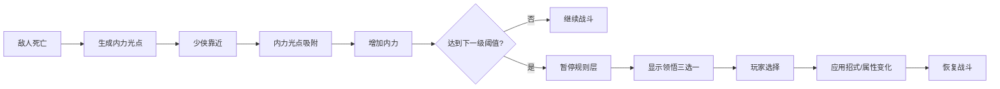

# 14 Inner Power And Insight System

## 目的

内力与领悟系统负责本局成长节奏。

它对应通用 survivor-like 里的经验和升级，但玩家可见文案统一为：

- `内力`：经验值和经验条。
- `等级`：本局等级。
- `领悟`：升级时的三选一选择。
- `进阶`：招式达到条件后的形态变化。

## 第一性原则

这个系统要解决三件事：

- 高频正反馈：击杀后 0.2 秒内看到掉落或吸附反馈。
- 稳定成长节奏：第一次领悟在 15 到 25 秒，前 3 分钟每 20 到 35 秒一次。
- 构筑有差异：每 2 到 3 次领悟，至少有一次能明显改变战斗表现。

如果玩家只是数字变大但看不出招式变化，这个系统失败。

## 核心流程



## 初始状态

| 项 | MVP 值 |
| --- | ---: |
| 初始等级 | 1 |
| 初始内力 | 0 |
| 第一次领悟阈值 | 24 |
| 初始招式 | 游龙剑气 Lv1 |
| 最大可持有招式数 | 6 |
| 单局目标领悟次数 | 8 到 18 |

少侠开局必须已经有 `游龙剑气 Lv1`，否则前 15 秒会缺少击杀反馈。

## 内力需求曲线

每次领悟后，等级 +1，内力溢出保留。

| 当前等级 | 升到下一级需要内力 |
| ---: | ---: |
| 1 | 24 |
| 2 | 34 |
| 3 | 52 |
| 4 | 74 |
| 5 | 100 |
| 6 | 130 |
| 7 | 164 |
| 8 | 202 |
| 9 | 244 |
| 10 | 290 |
| 11 | 340 |
| 12 | 394 |
| 13 | 452 |
| 14 | 514 |

15 级以后使用临时公式：

```text
nextRequired = previousRequired + 66 + (currentLevel - 14) * 8
```

调参规则：

- 第一次领悟早于 12 秒：提高前 2 级阈值或降低小内力掉落。
- 第一次领悟晚于 30 秒：降低第 1 级阈值或提高山贼喽啰掉落。
- 3 分钟内少于 4 次领悟：提高怪潮密度或掉落值。
- 3 分钟内多于 8 次领悟：提高 3 到 8 级阈值。

## 内力光点

| 档位 | 内力值 | 主要来源 | 视觉 |
| --- | ---: | --- | --- |
| 小内力 | 4 | 山贼喽啰、恶犬 | 小号蓝青光点 |
| 中内力 | 10 | 持盾山贼、黑衣快刀手 | 中号蓝青光点，亮度更高 |
| 大内力 | 30 | 木人机关、精英敌人 | 大号蓝青光点，短尾迹 |
| 头目内力 | 80 | 黑风寨主阶段奖励或死亡 | 大号光团，允许更强特效 |

当前 P0 实现把小内力从早期草案的 `3` 调到 `4`，是因为 `SW-COMBAT-002` 阶段只有山贼喽啰和低密度刷怪；如果仍按 `3`，第一次领悟会晚于 30 秒，不满足本系统第一性目标。后续 `SW-WAVE-001` 加入更高怪潮密度后，允许把小内力回调到 `3`，但必须重新验证第一次领悟仍在 15 到 25 秒。

MVP 敌人掉落建议：

| 敌人 | 掉落规则 |
| --- | --- |
| 山贼喽啰 | 100% 掉 1 个小内力 |
| 恶犬 | 80% 掉 1 个小内力 |
| 持盾山贼 | 100% 掉 1 个中内力 |
| 木人机关 | 100% 掉 1 个大内力 |

## 吸附规则

| 项 | MVP 值 |
| --- | ---: |
| 基础拾取半径 | 70px |
| 吸附触发半径 | 拾取半径 + 80px |
| 完成拾取距离 | 22px |
| 初始吸附速度 | 160px/s |
| 最大吸附速度 | 560px/s |
| 加速时间 | 0.35 秒 |
| 光点最长停留 | 60 秒 |

规则：

- 内力光点在吸附触发半径内开始飞向少侠。
- 吸附曲线可以用直线加速，后续再改曲线。
- 光点被拾取后立刻销毁或回收到对象池。
- 同屏内力光点超过 120 个时，允许把邻近小内力合并成中内力，优先保帧。

## 领悟触发

当 `currentInnerPower >= requiredInnerPower` 时：

- 等级 +1。
- 扣除本级所需内力，溢出保留。
- 战斗规则层暂停。
- 显示 `领悟` 三选一弹窗。
- 玩家选择后应用效果。
- 触发一次 `调息` 小回血：恢复 20 点血量，不超过最大血量。
- 恢复战斗。

如果一次拾取跨过多个等级：

- 只弹出 1 次领悟。
- 选择完成并恢复 0.3 秒后，再检查是否仍满足下一次领悟。
- 不允许一次弹出多个领悟窗口堆叠。

## 领悟时暂停规则

MVP 使用完整暂停，不使用慢动作。

暂停期间：

- 江湖敌人停止移动。
- 招式停止发射。
- 投射物停止移动。
- 内力光点停止吸附。
- 头目 AI 停止。
- 计时器停止。
- 少侠不能受伤。

UI 可以保留 0.15 到 0.25 秒弹入动画，但规则层必须已暂停。

领悟完成后的 20 点 `调息` 回血只补偿战斗节奏，不触发受伤无敌，不改变招式释放、内力需求或敌人状态。

## 领悟选项类型

| 类型 | 作用 | 示例 |
| --- | --- | --- |
| 新招式 | 获得一个未拥有招式 | 回风飞镖 Lv1 |
| 招式强化 | 提升已有招式等级或参数 | 游龙剑气 Lv2，伤害 +20% |
| 被动属性 | 强化少侠基础属性 | 轻功 +5%，拾取半径 +15px |
| 进阶信物 | 为招式进阶准备条件 | 剑谱残页、暗器囊、内劲心法 |
| 招式进阶 | 改变招式形态 | 游龙归海、回风连环 |

## 第一批固定领悟

为了避免新手第一局随机结果太差，MVP 前 3 次领悟采用半固定规则。

| 第几次领悟 | 规则 |
| ---: | --- |
| 1 | 必含 `回风飞镖 Lv1`、`游龙剑气 Lv2`、`轻功 +5%` |
| 2 | 必含 1 个已有招式强化、1 个被动、1 个随机合法项 |
| 3 | 如果只拥有 1 个招式，必含 1 个新招式 |

第 4 次以后使用权重池。

实现阶段记录：`SW-PROG-001` 曾在 `回风飞镖` 真实战斗逻辑完成前，把首轮领悟临时显示为 `磁石锦囊`、`游龙剑气 Lv2`、`轻功 +5%`，避免给玩家一个“获得新招式但没有任何战斗效果”的假选项。`SW-SKILL-001` 工程实现后，首轮固定项已恢复为 `回风飞镖 Lv1`、`游龙剑气 Lv2`、`轻功 +5%`。

## 权重池

基础权重：

| 阶段 | 新招式 | 招式强化 | 被动属性 | 进阶信物 | 招式进阶 |
| --- | ---: | ---: | ---: | ---: | ---: |
| 等级 2-4 | 40 | 40 | 15 | 5 | 0 |
| 等级 5-8 | 20 | 50 | 20 | 10 | 0 |
| 等级 9+ | 10 | 45 | 25 | 10 | 10 |

当某个招式满足进阶条件时：

- 至少 1 个三选一选项应是对应进阶。
- 进阶选项权重临时提高到 35。
- 玩家拒绝进阶后，下一次领悟仍继续提高权重。

## 合法性规则

每次三选一必须满足：

- 3 个选项互不重复。
- 不出现已满级招式的普通强化。
- 不出现已经完成的同名进阶。
- 如果少侠没有可强化招式，不能强行生成强化项。
- 如果招式槽已满，不能生成新招式，除非允许替换系统；MVP 暂不做替换。
- 被动属性达到上限后不能继续出现。

MVP 被动上限：

| 被动 | 单局上限 |
| --- | ---: |
| 轻功 | 5 级 |
| 拾取半径 | 5 级 |
| 最大血量 | 5 级 |
| 招式冷却 | 5 级 |

## 进阶条件

| 基础招式 | 条件 | 进阶结果 |
| --- | --- | --- |
| 游龙剑气 | 游龙剑气 Lv5 + 剑谱残页 | 游龙归海 |
| 回风飞镖 | 回风飞镖 Lv5 + 暗器囊 | 回风连环 |
| 震山掌 | 震山掌 Lv5 + 内劲心法 | 裂石掌风 |

进阶信物通过领悟选项获得，不通过翻阅秘籍获得，避免局外抽取成为通关必需。

## UI 规格

领悟弹窗：

- 标题固定为 `领悟`。
- 必须显示当前等级，例如 `等级 4 -> 等级 5`。
- 3 张卡片横向或纵向排列，移动端最小触控高度 72px。
- 每张卡必须包含：图标、名称、短描述、类型标签。
- PC 支持鼠标点击和数字键 `1/2/3`。
- 移动端支持点击卡片。

卡片示例：

```text
游龙剑气 Lv2
剑气伤害 +20%
类型：招式强化
```

禁止文案：

- 不写 `升级`。
- 不写 `经验` 或 `XP`。
- 不写 `武器`。
- 不写 `抽卡`。

## 事件和调试字段

建议事件名：

```text
inner_power_gem_spawned
inner_power_gem_collected
inner_power_changed
insight_ready
insight_opened
insight_option_selected
insight_applied
skill_advanced
```

调试面板字段：

| 字段 | 说明 |
| --- | --- |
| level | 当前等级 |
| innerPower | 当前内力 |
| nextRequired | 下次领悟需求 |
| insightCount | 本局领悟次数 |
| gemsAlive | 同屏内力光点 |
| lastInsightAt | 上次领悟发生时间 |
| pendingInsight | 是否有待处理领悟 |

## 数据结构建议

```ts
type InnerPowerTier = "small" | "medium" | "large" | "boss";

interface InnerPowerGemConfig {
  tier: InnerPowerTier;
  value: number;
  radius: number;
  spriteKey: string;
}

type InsightCategory =
  | "new_skill"
  | "skill_upgrade"
  | "passive"
  | "advance_key"
  | "skill_advance";

interface InsightOption {
  id: string;
  category: InsightCategory;
  title: string;
  description: string;
  iconKey: string;
  requires?: string[];
  applyEffectId: string;
}
```

## 验收

MVP 通过必须满足：

- 开局显示 `等级 1` 和 `内力 0/24`。
- 山贼喽啰死亡后生成小内力光点。
- 少侠靠近光点后，光点会吸附并增加内力条。
- 第一次领悟在参考调参下发生于 15 到 25 秒。
- 领悟弹窗出现时，敌人、投射物、内力光点、计时器全部暂停。
- 每次领悟出现 3 个合法且不重复的选项。
- 选择后能立即看到招式或属性变化。
- 内力溢出会保留，不会丢失。
- 满足进阶条件后，下一次领悟优先出现进阶选项。
- 玩家可见 UI 不出现 `经验`、`XP`、`升级`、`武器`、`抽卡`。

## 调参观察

开发者 3 分钟自测记录：

| 指标 | 目标 |
| --- | --- |
| 第一次领悟时间 | 15 到 25 秒 |
| 3 分钟领悟次数 | 4 到 8 次 |
| 每次领悟选择耗时 | <=8 秒 |
| 内力光点同屏峰值 | <=120 |
| 领悟后可感知变化 | 每 2 到 3 次至少 1 次 |

如果达不到这些目标，优先调整内力掉落和需求曲线，不先增加复杂系统。
