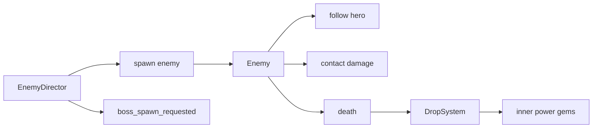

# 17 Enemy Wave And Director System

## 目的

江湖敌人与怪潮系统负责制造压力、给招式提供目标、给内力系统提供掉落来源。

它不是简单“敌人越多越好”。MVP 要验证的是：

- 压力逐步升高，玩家能感到 0 到 8 分钟的变化。
- 敌人生成公平，不突然刷在少侠脸上。
- 敌人类型能检验不同招式构筑。
- 同屏数量足够爽，但不牺牲桌面 60 FPS 和移动端 45 到 60 FPS。

## 第一性原则

怪潮系统要同时满足四个约束：

1. 可读：玩家能分辨慢怪、快怪、厚血怪和精英。
2. 公平：危险从屏幕外来，死亡原因能被理解。
3. 节奏：每 30 到 60 秒至少有一个压力变量变化。
4. 性能：刷怪系统必须服从实体预算，不能为了密度把帧率打崩。

如果敌人很多但玩家看不清自己怎么死，系统失败。如果敌人很公平但 3 分钟都没有压力变化，系统也失败。

## 范围

P0 必做：

- 3 类普通江湖敌人：`山贼喽啰`、`恶犬`、`持盾山贼`。
- 1 类精英敌人：`木人机关`。
- 0 到 8 分钟怪潮时间轴。
- 屏幕外生成、距离保护、回收和同屏预算。
- 敌人死亡掉落内力光点，和 [14 Inner Power And Insight System](14-inner-power-and-insight-system.md) 对齐。
- 第 6 分钟向头目系统发出 `黑风寨主` 生成请求。

P1 后续：

- `黑衣快刀手`。
- 远程敌人。
- 地形危险。
- 无限模式后 8 分钟扩展曲线。

非目标：

- 不做复杂寻路。
- 不做小怪主动技能。
- 不做小怪弹幕。
- 不做玩家可见硬边界。
- 不做会突然贴脸出现的伏击刷怪。

## 系统关系



边界：

- `EnemyDirector` 决定何时、何处、生成什么。
- `Enemy` 只负责移动、受击、接触伤害、死亡。
- `DropSystem` 负责实际生成内力光点、回血药丸和铜钱。
- `SkillSystem` 负责伤害敌人，不反向控制刷怪。
- 头目行为不在本文展开，只定义第 6 分钟的触发事件。

## 敌人配置字段

建议 `src/data/enemies.ts` 使用以下字段：

```ts
type EnemyTier = "normal" | "elite";
type EnemyRole = "basic" | "fast" | "tank" | "elite_pressure";

type EnemyConfig = {
  id: string;
  displayName: string;
  tier: EnemyTier;
  role: EnemyRole;
  maxHp: number;
  moveSpeed: number;
  contactDamage: number;
  collisionRadius: number;
  visualRadius: number;
  spawnAfterSeconds: number;
  innerPowerDrop: "small" | "medium" | "large";
  innerPowerDropChance: number;
  healDropChance: number;
  scoreValue: number;
  maxAliveShare: number;
  colorRole: string;
  assetId: string;
};
```

## P0 敌人表

| 敌人 | 类型 | 生命 | 速度 | 接触伤害 | 碰撞半径 | 出现时间 | 内力掉落 | 回血概率 | 作用 |
| --- | --- | ---: | ---: | ---: | ---: | ---: | --- | ---: | --- |
| 山贼喽啰 | 普通/basic | 28 | 72 px/s | 5 | 16 | 0s | 小内力 100% | 1% | 基础怪潮和击杀反馈，早期用于制造压力但不能稳定围死玩家 |
| 恶犬 | 普通/fast | 18 | 118 px/s | 8 | 14 | 35s | 小内力 80% | 1% | 逼迫走位，打破纯绕圈 |
| 持盾山贼 | 普通/tank | 80 | 48 px/s | 14 | 20 | 120s | 中内力 100% | 2% | 检验持续输出和穿透 |
| 木人机关 | 精英/elite_pressure | 260 | 42 px/s | 20 | 28 | 180s | 大内力 100% | 20% | 阶段压力和高价值目标 |

数值边界：

- P0 普通敌人不做护甲、闪避、暴击、抗性。
- `木人机关` 是精英，不进入普通连续刷怪池。
- `恶犬` 血量必须低于 `山贼喽啰`，否则快怪会过度惩罚走位。
- `持盾山贼` 速度必须低于 `山贼喽啰`，否则厚血怪会压死逃生空间。

## P1 敌人保留位

| 敌人 | 建议定位 | 暂不进 MVP 的原因 |
| --- | --- | --- |
| 黑衣快刀手 | 中速、高接触伤害 | 会和恶犬一起增加近身压力，MVP 先避免早期死因过乱 |
| 投石山贼 | 远程压制 | 需要额外预兆和弹道可读性 |
| 毒雾机关 | 区域限制 | 需要地形/范围危险规则，留到首关稳定后 |

## 怪潮时间轴

MVP 单局目标为 6 到 8 分钟。第 6 分钟触发头目请求，头目战期间普通刷怪降压。

| 时间 | 阶段 | 目标存活敌人 | 上限 | 刷怪间隔 | 敌人构成 | 设计目的 |
| ---: | --- | ---: | ---: | ---: | --- | --- |
| 0-10s | 入场缓冲 | 0-5 | 8 | 850ms | 山贼喽啰 100% | 给玩家确认移动、HUD 和第一批剑气命中 |
| 10-30s | 初压 | 5-10 | 16 | 700ms | 山贼喽啰 100% | 第一次击杀和内力掉落，不能在领悟前稳定围死玩家 |
| 30-60s | 走位压力 | 10-16 | 24 | 650ms | 山贼喽啰 100%；恶犬后置到 `SW-WAVE-001` | 让玩家看到第二/第三次领悟，同时开始需要移动回收内力 |
| 60-120s | 包围成形 | 35-55 | 70 | 360ms | 山贼 65%，恶犬 35% | 稳定击杀和前几次领悟 |
| 120-180s | 厚血检验 | 55-80 | 95 | 320ms | 山贼 55%，恶犬 30%，持盾 15% | 检验持续输出 |
| 180-240s | 精英登场 | 80-110 | 125 | 280ms | 山贼 50%，恶犬 30%，持盾 20% | 木人机关首次出现 |
| 240-300s | 高压潮 | 100-135 | 155 | 240ms | 山贼 45%，恶犬 35%，持盾 20% | 逼构筑成型 |
| 300-360s | 头目前压 | 120-160 | 180 | 220ms | 山贼 45%，恶犬 30%，持盾 25% | 进入头目前的压力峰值 |
| 360-480s | 头目战 | 70-120 | 125 | 420ms | 山贼 55%，恶犬 25%，持盾 20% | 给头目攻击留可读空间 |

平台预算换算：

- 上表是桌面标准曲线。
- 移动端使用 `effectiveAliveCap = min(segment.aliveCap, 120)`。
- 低画质模式使用 `effectiveAliveCap = min(segment.aliveCap, 90)`。
- `targetAliveMin` 和 `targetAliveMax` 按 `effectiveAliveCap / segment.aliveCap` 等比例缩放，并向下取整。
- 调试面板同时显示原始 `segment.aliveCap` 和实际 `effectiveAliveCap`，验收以实际值为准。

调参规则：

- 第一次领悟晚于 25 秒：优先提高 10-60s 的山贼数量或小内力掉落，不先降低领悟阈值。
- 2 分钟前死亡过多：先降低恶犬比例到 20%，再考虑降低接触伤害。
- 3 分钟后没有压力：提高目标存活敌人 10% 或提前持盾山贼，不提高所有敌人速度。
- 头目战看不清预兆：降低头目战普通敌人上限到 100，或降低持盾比例。

## Director 状态机

```text
warmup
build
pressure
elite_warning
elite_active
boss_pre
boss_active
cleared
dead
```

状态规则：

- `warmup`：0 到 30 秒，只生成山贼喽啰。
- `build`：30 到 120 秒，加入恶犬，目标是稳定领悟。
- `pressure`：120 到 300 秒，加入持盾山贼和精英周期。
- `elite_warning`：木人机关生成前 1.2 秒显示边缘预警。
- `elite_active`：木人机关存在时保持，普通刷怪不额外加速。
- `boss_pre`：300 到 360 秒，准备头目入场。
- `boss_active`：头目存在，普通刷怪降到 35% 到 65% 压力。
- `cleared`：胜利结算前停止刷怪。
- `dead`：少侠死亡，全部停止。

## 刷怪位置

刷怪必须满足：

- 生成在当前镜头外侧 `120` 到 `260px`。
- 生成点到少侠距离必须 `>=220px`。
- 不能生成在 HUD 常驻区域内部。
- 不使用可见硬边界、墙体或地图尽头。
- 同一帧最多生成 `8` 个普通敌人。
- 同一侧连续生成超过 `4` 批后，下一批必须换侧或随机打散。

生成方向权重：

| 区域 | 权重 | 说明 |
| --- | ---: | --- |
| 少侠移动前方 | 35% | 制造前进阻力 |
| 左右侧 | 40% | 形成包围 |
| 后方 | 20% | 防止只向一个方向逃跑 |
| 随机角落 | 5% | 打散规律 |

如果少侠速度小于 `20px/s`，不使用前方权重，改为四边均匀随机。

`SW-COMBAT-001` 工程临时限制：

- 在 HUD 顶部安全通道和完整方向权重实现前，基础山贼只从左、右、下三侧生成。
- 这样仍必须满足屏幕外 `120` 到 `260px`、距少侠 `>=220px`、接触扣血和暂停冻结验收。
- 顶部生成、前方/后方权重和连续同侧打散留到 `SW-WAVE-001`，届时需要避免敌人从顶部 HUD 常驻区域穿过。

## 精英生成

`木人机关` 不是普通刷怪池的一部分。

规则：

- 第一次生成时间：180 秒。
- 之后每 45 到 60 秒尝试生成 1 只。
- 同时最多存在 2 只。
- 生成前 1.2 秒在屏幕边缘显示预警标记。
- 预警音效使用 `elite_warning`，同一时间最多播放 1 次。
- 精英死亡掉落大内力，20% 概率掉回血药丸。

精英生成条件：

- 当前不是 `boss_active` 的前 15 秒。
- 当前活跃敌人没有超过当前上限的 90%。
- 少侠不在死亡、暂停、领悟、战后清点状态。

## 敌人移动

P0 使用简单追踪，不做路径搜索。

规则：

- 每个敌人朝少侠当前位置移动。
- 方向向量每 `100ms` 更新一次，移动插值每帧执行。
- 敌人之间允许轻微重叠，但碰撞半径内加入低成本分离力。
- 分离力只检查邻近网格，不全量两两检查。
- 被击退时，击退速度叠加到移动速度上，并在 `180ms` 内衰减。
- 暂停、领悟、战后清点和死亡时敌人移动停止。

低成本分离建议：

```text
cellSize = 128px
check current cell + 8 neighbor cells
separationRadius = enemy.collisionRadius * 1.25
maxSeparationPush = 28px/s
```

## 接触伤害

接触伤害沿用 [15 Hero Movement And Damage System](15-hero-movement-and-damage-system.md)：

- 只有碰撞圆重叠时才尝试造成伤害。
- 少侠扣血后触发 `0.6s` 受伤无敌。
- 无敌期间敌人仍可移动，但不重复扣血。
- 接触伤害不因为敌人数量叠加成同帧多次扣血。

伤害表：

| 敌人 | 接触伤害 |
| --- | ---: |
| 山贼喽啰 | 5 |
| 恶犬 | 8 |
| 持盾山贼 | 14 |
| 木人机关 | 20 |

## 掉落规则

掉落值以 [14 Inner Power And Insight System](14-inner-power-and-insight-system.md) 为准。

| 敌人 | 内力掉落 | 掉落概率 | 其他掉落 |
| --- | --- | ---: | --- |
| 山贼喽啰 | 小内力 `3` | 100% | 回血药丸 1% |
| 恶犬 | 小内力 `3` | 80% | 回血药丸 1% |
| 持盾山贼 | 中内力 `8` | 100% | 回血药丸 2% |
| 木人机关 | 大内力 `25` | 100% | 回血药丸 20% |

禁止：

- 不掉付费货币。
- 不掉限时礼包。
- 不掉需要付费开启的宝箱。
- MVP 普通战斗不掉铜钱；新增铜钱来自战后清点，翻阅秘籍重复补偿只作为消耗返还记录。

## 回收规则

为了支持无可见硬边界体验，敌人按少侠相对距离回收：

- 普通敌人距离少侠 `>1400px`：回收。
- 精英距离少侠 `>1700px` 且离屏超过 5 秒：回收并允许 20 秒后重刷。
- 头目不使用本文回收规则，交给头目系统。
- 回收不触发击杀、内力、铜钱或音效。

如果 10 秒内回收敌人超过 30 只，说明刷怪方向或移动速度有问题，需要在调试面板标红。

## 性能预算

| 项 | 桌面目标 | 移动端目标 | 低画质模式 |
| --- | ---: | ---: | ---: |
| 普通敌人活跃上限 | 180 | 120 | 90 |
| 精英敌人活跃上限 | 2 | 1 | 1 |
| 单帧生成普通敌人 | 8 | 6 | 4 |
| 敌人方向更新频率 | 10Hz | 8-10Hz | 6Hz |
| 接触检测频率 | 每帧或 20Hz | 20Hz | 15Hz |
| 空间网格 cell | 128px | 128px | 160px |

降级规则：

- FPS 连续 5 秒低于 45：目标存活敌人降低 15%。
- FPS 连续 10 秒低于 40：进入低画质刷怪预算。
- FPS 恢复到 55 以上并持续 10 秒：逐步恢复预算，每 5 秒恢复 5%，直到当前阶段目标。
- 降级只影响后续刷怪，不瞬间删除屏幕内敌人。
- 性能降级后重新计算 `effectiveAliveCap` 和目标存活范围，不直接使用桌面曲线。

## 配置建议

建议 `src/data/waves.ts`：

```ts
type EnemyId = "bandit_grunt" | "hound" | "shield_bandit" | "wooden_dummy_elite";

type WaveSegment = {
  id: string;
  startSeconds: number;
  endSeconds: number;
  targetAliveMin: number;
  targetAliveMax: number;
  aliveCap: number;
  spawnIntervalMs: number;
  composition: Partial<Record<EnemyId, number>>;
};

type EnemyDirectorConfig = {
  spawnOutsideMin: number;
  spawnOutsideMax: number;
  minSpawnDistanceFromHero: number;
  enemyDespawnDistance: number;
  eliteDespawnDistance: number;
  maxSpawnPerFrame: number;
  bossRequestSeconds: number;
};
```

MVP 默认：

```text
spawnOutsideMin = 120
spawnOutsideMax = 260
minSpawnDistanceFromHero = 220
enemyDespawnDistance = 1400
eliteDespawnDistance = 1700
maxSpawnPerFrame = 8
bossRequestSeconds = 360
```

## 事件

建议事件名：

| 事件 | 触发 |
| --- | --- |
| `wave_state_changed` | Director 阶段变化 |
| `enemy_spawned` | 敌人生成 |
| `enemy_damaged` | 敌人受击 |
| `enemy_killed` | 敌人死亡并计入击杀 |
| `enemy_despawned` | 敌人远离回收 |
| `elite_warning` | 精英预警出现 |
| `elite_spawned` | 精英生成 |
| `boss_spawn_requested` | 第 6 分钟请求头目入场 |
| `director_budget_changed` | 性能降级或恢复 |

## 调试字段

调试面板至少显示：

```text
waveTimeSeconds
directorState
targetAlive
aliveCap
enemiesAlive
enemiesAliveByType
spawnIntervalMs
lastSpawnDistanceFromHero
minSpawnDistanceLast30s
despawnCountLast10s
eliteAlive
nextEliteSeconds
bossRequestEmitted
qualityScale
```

红线提示：

- `minSpawnDistanceLast30s < 220`
- `enemiesAlive > aliveCap`
- `despawnCountLast10s > 30`
- `bossRequestSeconds > 390`
- `qualityScale < 0.75` 持续 30 秒

## 验收

P0 通过标准：

- 10 秒内出现第一批山贼喽啰。
- 前 30 秒不出现恶犬、持盾山贼或木人机关。
- 35 到 60 秒内恶犬加入。
- 120 到 150 秒内持盾山贼加入。
- 180 到 210 秒内第一次木人机关预警并生成。
- 第 360 秒触发 `boss_spawn_requested`，普通刷怪压力下降。
- 连续 3 分钟测试中，没有任何敌人生成在少侠 `220px` 内。
- 同屏 120 个江湖敌人时，桌面目标接近 60 FPS，移动端不低于 45 FPS。
- 敌人死亡掉落符合本文掉落表，内力数值和 14 号文档一致。
- 暂停和领悟期间，敌人移动、生成、接触伤害和精英倒计时全部停止。
- 回收敌人不增加击杀、不掉内力、不播放死亡音效。
- 玩家可见 UI 不出现 `怪物等级`、`金币怪`、`经验怪`、`付费宝箱` 等破坏当前文案体系的词。

## 开发者自测脚本

1. 开始新局，等待 10 秒，确认山贼从屏幕外进入。
2. 原地绕圈 30 秒，确认没有敌人贴脸生成。
3. 游玩到 60 秒，确认恶犬加入且血少速度快。
4. 游玩到 150 秒，确认持盾山贼加入且更难打死。
5. 游玩到 210 秒，确认木人机关有 1.2 秒预警后出现。
6. 连续朝一个方向移动 60 秒，确认敌人从屏幕外补入，远处敌人被回收，无黑屏或硬墙。
7. 打开暂停页 10 秒，确认敌人位置和刷怪计时不变化。
8. 触发领悟，确认敌人、精英倒计时和生成全部暂停。
9. 人为压到 120 个敌人，确认帧率和调试面板预算字段。
10. 到第 360 秒，确认发出头目请求并降低普通怪潮。

通过条件：

- 10 步全部可复现。
- 无 P0/P1。
- 调试面板没有红线提示持续超过 10 秒。
