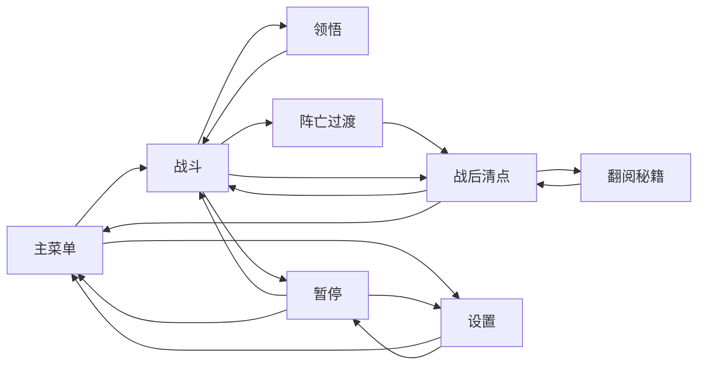

# 21 HUD Pause Screen Flow Detail

## 目的

本文细化 [11 Audio HUD Pause](11-audio-hud-pause.md)，把主菜单、HUD、暂停、设置、领悟、阵亡过渡、战后清点和翻阅秘籍页面拆成可实现布局和状态。

第一性原则：

- 战斗中只显示当下决策需要的信息。
- 移动端触控优先，按钮不小于可点击尺寸。
- 页面状态必须暂停或恢复规则层，不能只改显示。
- 玩家可见文案统一，不混用 `经验`、`金币`、`武器`、`升级`、`抽卡`。

## 战斗 HUD 布局

| 区域 | 内容 | 桌面尺寸 | 移动端尺寸 | 规则 |
| --- | --- | ---: | ---: | --- |
| 左上 | 血量、等级 | 220x72 | 260x88 | 不超过 2 行 |
| 顶部中 | 内力条 | 宽 40%-55% | 宽 46%-62% | 不遮挡头目血条 |
| 右上 | 时间、击杀、暂停 | 220x72 | 260x88 | 暂停触控区 >=72x72 |
| 底部中 | 招式槽 | 4-6 格 | 4-6 格 | 每格 >=56x56 |
| 头目出现 | 头目血条 | 宽 55%-70% | 宽 64%-80% | 入场 1 秒内显示 |

安全区：

- 少侠半径 180px 内不放常驻 HUD。
- HUD 不贴屏幕边缘，安全边距 >=16px，移动端 >=24px。
- 数字变长不能导致布局跳动。

## 玩家可见文案

核心玩法词只允许显示：

- `血量`
- `等级`
- `内力`
- `铜钱`
- `招式`
- `领悟`
- `进阶`
- `战后清点`
- `翻阅秘籍`
- `翻阅一次`
- `翻阅十次`
- `秘籍残页`

页面和按钮允许显示：

- `开始闯荡`
- `继续`
- `重新开始`
- `回主菜单`
- `再来一局`
- `设置`
- `力竭倒地`
- `胜利`
- `失败`

禁止玩家可见：

- `HP`
- `XP`
- `经验`
- `金币`
- `武器`
- `升级`
- `进化`
- `抽卡`
- `Gacha`

## 页面状态机



## 主菜单页面

目标：打开网页后 5 秒内能开始第一局，不让玩家先读说明。

布局：

| 区域 | 内容 | 规则 |
| --- | --- | --- |
| 顶部 | 游戏名或关卡名 `青石山道` | 不放长剧情 |
| 中部 | 少侠剪影、山道背景、最近最好成绩 | 背景可动但不能影响可读性 |
| 主要按钮 | `开始闯荡` | 首屏最大按钮，移动端高度 >=72px |
| 次要按钮 | `翻阅秘籍`、`设置` | 没有存档时 `翻阅秘籍` 可显示但按钮置灰 |
| 底部 | 当前铜钱、最高时间、最高击杀 | 最多 2 行 |

规则：

- 第一次打开且无存档时，默认焦点在 `开始闯荡`。
- 主菜单不显示商城、充值、广告、体力或每日任务。
- 主菜单不做多关卡选择，MVP 只进入 `青石山道`。
- `翻阅秘籍` 从主菜单进入时返回主菜单；从战后清点进入时返回战后清点。

按钮状态：

| 按钮 | 可用条件 | 不可用提示 |
| --- | --- | --- |
| `开始闯荡` | 总是可用 | 无 |
| `翻阅秘籍` | 当前铜钱 >=300 或已有收藏 | `铜钱不足` |
| `设置` | 总是可用 | 无 |

## 暂停规则

暂停入口：

- 键盘：`Esc` 或 `P`。
- 移动端：右上暂停按钮。

暂停时必须停止：

- 敌人移动。
- 敌人生成和精英倒计时。
- 招式冷却和释放。
- 投射物移动。
- 内力光点吸附。
- 头目 AI。
- 计时器。
- 接触伤害。
- 音频中循环危险提示。

暂停页按钮：

- `继续`
- `重新开始`
- `回主菜单`
- `设置`

按钮尺寸：

- 桌面最小 180x48。
- 移动端最小 240x72。
- 按钮间距 >=12px。

## 领悟页面

触发：等级提升后。

规则：

- 战斗规则层完全暂停。
- 显示 3 张卡片。
- 卡片包含：图标、标题、短说明、当前等级变化。
- 移动端卡片高度 >=150px，点击区不能小于 220x140。
- 选择后播放 `insight`，0.3 秒内恢复战斗。

禁止：

- 领悟页显示长篇说明。
- 领悟页出现翻阅秘籍入口。
- 领悟页出现任何付费入口。

## 阵亡过渡画面

触发：少侠血量 `<= 0`。

定位：这是从战斗到战后清点的短过渡，不是独立结算页。

表现：

- 画面降饱和 40% 到 60%，四周轻微暗红或墨色压边。
- 少侠播放倒下或淡出动画，时长 0.8 到 1.2 秒。
- 敌人、投射物、头目和计时器停止，敌人透明度降低到 35% 到 55%。
- 中央短文案：`力竭倒地`。
- 下方显示一行死因提示，例如 `被山贼围住`、`被黑风寨主击中`、`血量耗尽`。
- 播放 `hero_die`，随后播放或延迟到战后清点的 `result_open`。

交互：

- 0.6 秒内不接受点击，避免误触。
- 0.6 秒后点击或按空格可以跳过剩余过渡，直接进入战后清点。
- 不显示 `再来一局`、`返回主菜单` 或 `翻阅秘籍` 按钮；这些按钮只在战后清点页出现。

验收：

- 玩家能在 2 秒内知道自己已经阵亡。
- 死亡后不会继续扣血、刷怪、释放招式或移动掉落物。
- 阵亡过渡最长不超过 1.5 秒，不能拖慢重开节奏。

## 战后清点页面

显示：

| 区域 | 内容 | 规则 |
| --- | --- | --- |
| 顶部横幅 | `胜利` 或 `失败` | 胜利来自击败 `黑风寨主`，失败来自少侠阵亡 |
| 左侧/上半 | 存活时间、击杀、等级、是否击败 `黑风寨主` | 移动端单列显示 |
| 中央奖励 | `铜钱 +N`、头目奖励、最高纪录变化 | 铜钱数字最大，但不能像付费货币 |
| 底部按钮 | `再来一局`、`返回主菜单`、`翻阅秘籍` | 移动端纵向堆叠 |

按钮：

- `再来一局`
- `返回主菜单`
- `翻阅秘籍`

规则：

- 进入页面时战斗世界停止。
- 失败也结算铜钱。
- 胜利显示头目奖励。
- 页面出现后 8 秒内必须能重开。
- 结算铜钱只计算一次，刷新页面不能重复领取同一局奖励。
- 如果铜钱不足 300，`翻阅秘籍` 可进入页面查看概率，但 `翻阅一次` 置灰。
- 页面不得出现复活、广告加倍、付费加速、限时奖励。

## 翻阅秘籍页面

显示：

| 区域 | 内容 | 规则 |
| --- | --- | --- |
| 顶部 | `翻阅秘籍`、当前铜钱 | 当前铜钱始终可见 |
| 概率区 | common/rare/elite/epic 概率和保底说明 | 默认展开，不能藏在小问号里 |
| 操作区 | `翻阅一次 300 铜钱`、`翻阅十次 3000 铜钱` | 铜钱不足时置灰并显示 `铜钱不足` |
| 结果区 | 1 张或 10 张秘籍结果卡 | 稀有度边框和文字同时区分 |
| 补偿区 | 重复奖励转化说明 | 重复时必须显示补偿结果 |

`SW-ART-014` 后页面流：

- 同一页面顶部提供 `局外成长` / `翻阅秘籍` 两个页签。
- `局外成长` 页必须同屏展示 `体魄训练`、`轻功步法`、`磁石锦囊` 三项，主图标显示 48px 到 64px，按钮只写 `提升`，不出现任何外部购买语义。
- `翻阅秘籍` 页默认展示概率、当前铜钱、距离保底剩余次数、`翻阅一次 300 铜钱` 和 `翻阅十次 3000 铜钱`。
- 结果区需覆盖单次结果、十连网格、重复转化补偿和铜钱不足状态；移动横屏下主奖励图标不得低于 48px。

`2026-05-07` 布局修正规则：

- `翻阅秘籍` / `局外成长` 使用一个外层美术面板和一个干净内容面板，不再在默认态叠放多层概率底板、空结果框或大块半透明装饰。
- `翻阅秘籍` 默认态只展示当前铜钱、距保底、4 行公开概率、保底说明、一次/十次按钮和一行状态文案；未翻阅前不显示空结果槽。
- `局外成长` 默认态使用 3 列固定卡片，同屏展示图标、名称、效果、等级、下一阶花费和 `提升` 按钮；卡片之间最小水平间距 >=20px。
- 左上 HUD 不再单独显示 `血量` 标签，血条内的 `当前/最大  等级 N` 作为生命和等级的唯一常驻文本，避免窄面板压框。

`2026-05-07` 试玩修正规则：

- `领悟` 卡片描述必须按中文视觉长度换行，单行建议不超过 9 个全角字符，最多 2 行；超过时省略，不能横向穿出卡面。
- 进阶信物图标必须显式映射，不能用“非回风都落到掌风”的默认规则：`剑谱残页` 使用残页图标，`暗器囊` 使用囊袋类图标，`内劲心法` 使用心法碎片图标。
- 顶部 HUD 的血量、时间和击杀文本必须放在暗色内条内，不能直接压在美术装饰槽上；血条填充高度必须小于等于容器高度。
- 当前 HUD 面板可作为工程修正版继续使用；如果后续仍觉得气质不统一，应让美术侧新增血量/时间专用 HUD 面板，而不是继续复用通用槽位面板。

`SW-ART-015` 接入后规则：

- 左上血量/等级、顶部内力、右上时间/击杀必须优先使用 `ui_hud_health_panel`、`ui_hud_inner_power_bar`、`ui_hud_run_panel`，纹理缺失时保留工程 fallback。
- 底部招式槽必须优先使用 `ui_hud_skill_slot`；进阶招式优先使用 `ui_hud_skill_slot_advanced`，缺失时用普通槽位加 tint/描边区分。
- 领悟页进阶信物必须使用专属图标：`剑谱残页`、`暗器囊`、`内劲心法` 不再复用掌风、飞镖、普通残页或局外成长图标。
- 三个 P0 招式的基础/进阶图标必须成对区分：基础图标表达招式类型，进阶图标表达同一招式变强，不能只靠文字 `Lv` 区分。

`SW-ART-016` 接入后规则：

- 领悟页被动选项必须优先使用 `ui_icon_passive_body_training`、`ui_icon_passive_lightfoot`、`ui_icon_passive_pickup_radius`，纹理缺失时才回退到旧图标。
- 翻阅秘籍奖励和补偿必须优先使用 `ui_icon_scripture_*` 与 `ui_icon_scripture_compensation_*`，避免继续复用 `SW-ART-014` 的旧奖励图标；未知进阶信物的 fallback 也使用 `ui_icon_scripture_compensation_fragment`。
- 保底和重复补偿提示可以配合 `ui_badge_pity`、`ui_badge_duplicate`，但不得做成限时促销、红点催促或充值入口。
- 设置页开关必须优先使用 `ui_toggle_on` / `ui_toggle_off`，音量滑杆必须优先使用 `ui_slider_track` / `ui_slider_knob`，禁用按钮必须优先使用 `ui_button_disabled`。
- 设置页当前工程验收坐标以 `evidence/2026-05-07-sw-art-016-import/screenshots/03-settings-controls-desktop.png` 和 `07-settings-controls-mobile.png` 为基线：5 行设置项与返回按钮必须在面板内可见，slider 轨道和滑块按原生 `320x48` / `48x48` 显示。

结果揭示流程：

1. 点击按钮后立即扣除铜钱并写入待确认记录。
2. 播放 0.6 到 1.0 秒 `vfx_scripture_reveal`。
3. 显示结果卡，普通结果最多 0.5 秒延迟，稀有及以上可以有更强音效。
4. 玩家点击空白处或 `确认` 后返回翻阅页面。
5. 十连结果按网格展示，移动端使用 2 列或横向滚动，不允许卡片小到看不清。

禁止：

- 充值按钮。
- 广告按钮。
- 限时池倒计时。
- 每日免费但诱导登录压力。
- 使用 `抽卡`、`Gacha`、`充值`、`礼包` 作为玩家可见词。

## 设置页面

设置项：

| 设置 | 默认 | UI |
| --- | ---: | --- |
| 主音量 | 1.0 | 滑条 |
| 音乐音量 | 0.6 | 滑条 |
| 音效音量 | 0.8 | 滑条 |
| 静音 | false | 开关 |
| 低 VFX 模式 | false | 开关 |

刷新页面后设置必须保留。

## 数据结构建议

```ts
type ScreenState =
  | "menu"
  | "game"
  | "insight"
  | "pause"
  | "settings"
  | "death_transition"
  | "result"
  | "scripture";

type HudSnapshot = {
  hp: number;
  maxHp: number;
  level: number;
  innerPower: number;
  nextInnerPower: number;
  copper: number;
  kills: number;
  timeSeconds: number;
  skills: HudSkillSlot[];
  boss?: BossHudState;
  deathCause?: string;
};
```

## 事件

| 事件 | 触发 |
| --- | --- |
| `screen_changed` | 页面切换 |
| `menu_start_clicked` | 主菜单开始本局 |
| `hud_updated` | HUD 核心状态刷新 |
| `pause_opened` | 暂停打开 |
| `pause_closed` | 暂停关闭 |
| `settings_changed` | 设置变化 |
| `insight_option_selected` | 领悟选择 |
| `death_transition_started` | 阵亡过渡开始 |
| `result_screen_opened` | 战后清点打开 |
| `scripture_screen_opened` | 翻阅秘籍打开 |
| `scripture_result_confirmed` | 翻阅结果确认 |

## 验收

- 主菜单 5 秒内能点击 `开始闯荡` 进入战斗。
- 3 分钟战斗中 HUD 不遮挡少侠半径 180px。
- 暂停 10 秒后，敌人、投射物、计时器、伤害、头目状态不变化。
- 领悟时所有战斗规则暂停，选择后恢复。
- 移动端暂停按钮触控区 >=72x72。
- 血量归零后先出现 0.8 到 1.2 秒阵亡过渡，再进入战后清点。
- 战后清点能重开、回菜单、进入翻阅秘籍。
- 翻阅秘籍页面概率公开、铜钱不足状态清楚、结果卡可读。
- 局外成长 3 项同屏可读，点击区不和说明文字重叠。
- 设置刷新后保留。
- 玩家可见 UI 不出现禁用词。
